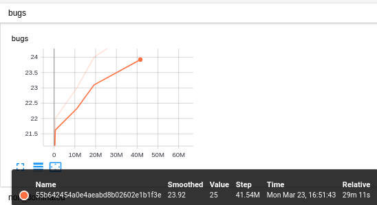

# Wuji: Automatic Online Combat Game Testing Using Evolutionary Deep Reinforcement Learning


This is the original source code of the [ASE 2019 paper (distinguished paper award)](https://2019.ase-conferences.org/details/ase-2019-papers/39/Wuji-Automatic-Online-Combat-Game-Testing-Using-Evolutionary-Deep-Reinforcement-Lear) for game testing,
which combines multi-objective evolutionary algorithm (MOEA) and deep reinforcement learning (DRL) to explore game state and discover bugs.
Detailed information can be found in:

```
@InProceedings{,
  author    = {Yan Zheng and Xiaofei Xie and Ting Su and Lei Ma and Jianye Hao and Zhaopeng Meng and Yang Liu and Ruimin Shen and Yinfeng Chen and Changjie Fan},
  title     = {Wuji: Automatic Online Combat Game Testing Using Evolutionary Deep Reinforcement Learning},
  booktitle = {IEEE/ACM International Conference on Automated Software Engineering},
  year      = {2019},
}
```

# Main Contributors of This Paper

* core idea: Ruimin Shen
* algorithm implementation: Ruimin Shen
* game environment (block maze): Yan Zheng
* experiment: Yan Zheng and Ruimin Shen
* paper writing: Yan Zheng and Xiaofei Xie et al.

# How to Use

This code is tested in Ubuntu 18.04.
First the dependent Python libraries should be installed by typing `pip3 install -r requirements.txt` in a terminal.
Then start a clean (delete all model data via the `-d` argument if you want) experiment by typing `python3 ea.py -d`.
After a while, the number of founded bugs can be seen via TensorBoard (`tensorboard --logdir ~/model/wuji`).


